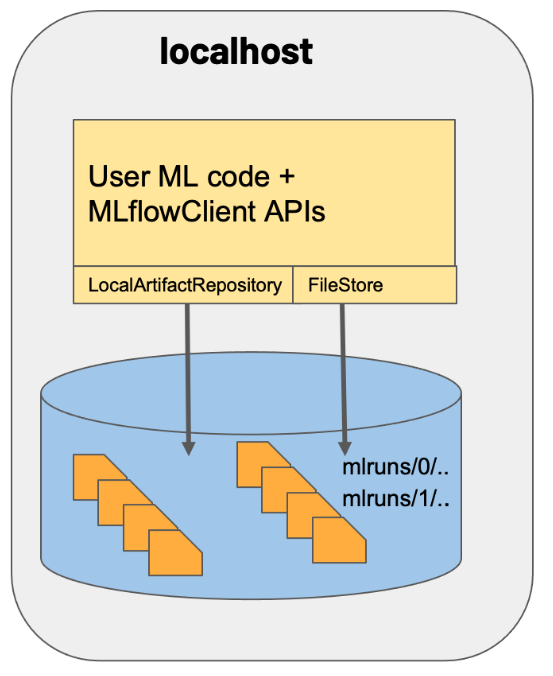
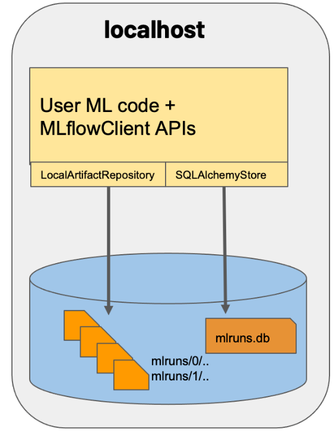
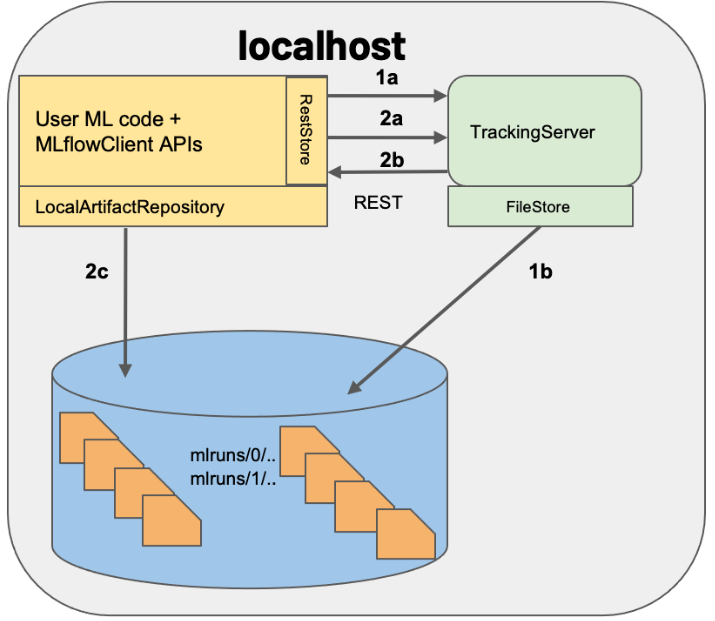
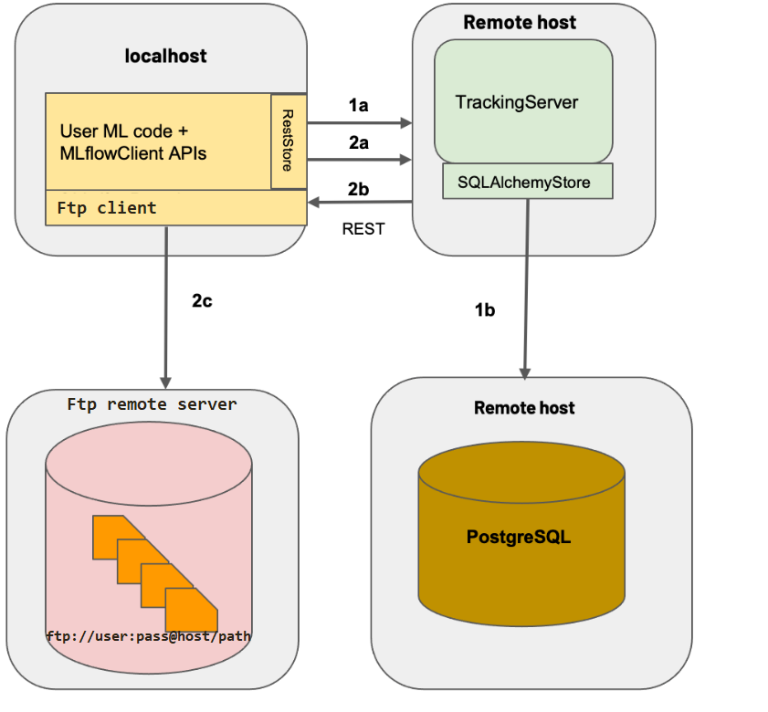

# Mlfow example: Tracking, Models, Registry

***

sum text

## Mlflow Tracking

### `Example 1`: MLflow on localhost

### `Example 2`: MLflow on localhost with SQLite

### `Example 3`: MLflow on localhost with TrackingServer 

#### `Docker compose`:  Mlflow remote server + jupyter/noteebok with Mlflow client and sqlite file-store

### `Example 4`: MLflow with remote Tracking Server, backend and artifact stores

#### `Docker compose`:  Mlflow remote server + jupyter/noteebok with Mlflow client + file-store postgres + artifact-store ftp-server

<

